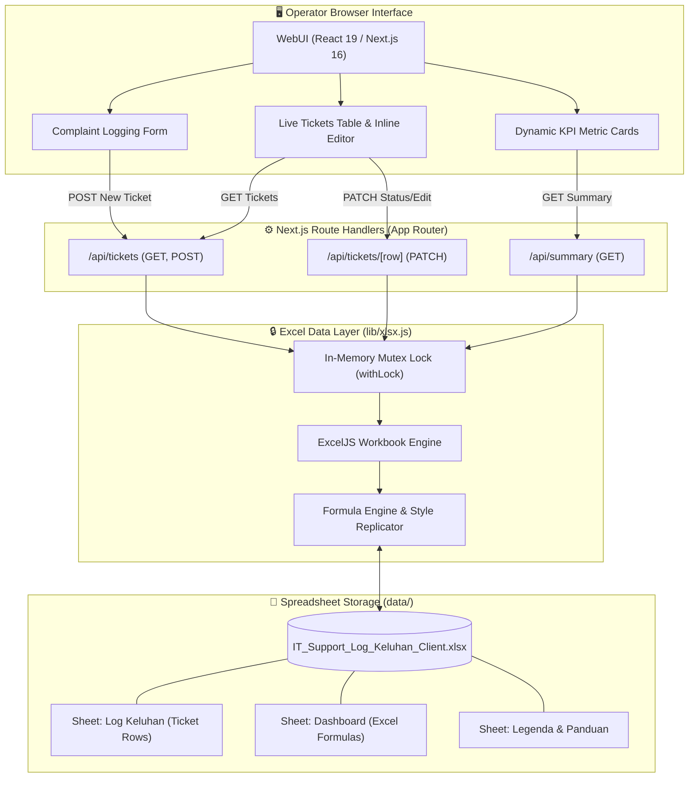

# 🎫 IT Support — WebUI & Excel Client Ticket Management System

[](https://nextjs.org/)
[](https://react.dev/)
[](https://github.com/exceljs/exceljs)
[](https://nodejs.org/)
[](LICENSE)
[](https://github.com/)

> A modern, lightweight **Next.js web application** for IT Support operators to seamlessly capture, triage, and resolve client complaints with **direct, real-time bidirectional synchronization to Microsoft Excel (`.xlsx`) workbooks**.

---

## 📸 Interface Showcase

| 📊 WebUI Dashboard & Live Ticket Management |
| :-----------------------------------------: |
|  |

| ⚡ Next.js Terminal Execution |
| :---------------------------: |
|  |

---

## 📑 Table of Contents

- [Overview](#-overview)
- [Key Features](#-key-features)
- [Architecture \& Data Flow](#-architecture--data-flow)
- [Tech Stack](#-tech-stack)
- [Directory Structure](#-directory-structure)
- [Quick Start \& Installation](#-quick-start--installation)
- [REST API Reference](#-rest-api-reference)
- [Excel Data Model \& Schema](#-excel-data-model--schema)
- [Operational Guidelines \& Concurrency](#-operational-guidelines--concurrency)
- [Configuration \& Customization](#-configuration--customization)
- [Future Roadmap](#-future-roadmap)
- [Panduan Penggunaan (Bahasa Indonesia)](#-panduan-penggunaan-bahasa-indonesia)
- [License](#-license)

---

## 🌟 Overview

Managing IT Support logs in corporate spreadsheets often results in race conditions, formatting breakage, and tedious manual data entry. Conversely, deploying heavyweight ticketing software (like Jira or Zendesk) creates unnecessary friction for lightweight internal workflows.

**IT Support WebUI** solves this by turning your existing Microsoft Excel spreadsheet (`data/IT_Support_Log_Keluhan_Client.xlsx`) into a headless data store. IT Support operators get a fast, intuitive browser interface, while management retains full access to native Excel dashboards, charts, and formulas.

---

## ✨ Key Features

- **⚡ Direct Two-Way Excel Synchronization**: Every submitted ticket or status change is written directly to the underlying `.xlsx` file using `ExcelJS`.
- **📊 Real-Time Metric Summary Cards**: Dynamic KPI calculation for **Total Tickets**, **Open**, **In Progress**, **Closed**, and **High Priority** tickets.
- **🛡️ Concurrency & Mutex Write Lock**: In-memory async mutex queue (`withLock`) prevents race conditions and prevents file corruption during simultaneous requests.
- **📐 Formula & Style Preservation**: Automatically copies styling, borders, fonts, number formatting, and native Excel formulas (`IF`, `ROW`, duration calculation) to every new row.
- **🔄 Instant Inline Status Workflow**: Update status directly from the data table. Marking a ticket as **Closed** automatically stamps today's date as `Tanggal Selesai`.
- **✏️ Inline Ticket Editing**: Expandable editing drawer to update Solution notes, assigned PIC, resolution date, and operational remarks without leaving the dashboard.
- **🎨 Visual Status & Priority Badging**: Color-coded badges for quick identification of critical and overdue tickets.
- **🚫 Zero External Database Requirement**: Runs completely self-contained without setting up PostgreSQL, MySQL, or MongoDB.

---

## 🏛️ Architecture & Data Flow



---

## 🛠️ Tech Stack

| Layer | Technology | Details |
| :--- | :--- | :--- |
| **Frontend Framework** | [Next.js 16 (App Router)](https://nextjs.org/) | Fast client-side rendering with React 19 |
| **UI Engine** | [React 19](https://react.dev/) | Hooks (`useState`, `useEffect`, `useCallback`) & modular components |
| **Styling** | Vanilla CSS3 | Custom CSS variables design tokens, responsive data tables |
| **Backend & Routing** | Next.js Dynamic Route Handlers | Serverless API routes configured with `force-dynamic` |
| **Storage Engine** | [ExcelJS 4.4](https://github.com/exceljs/exceljs) | Low-level spreadsheet parsing, formula preservation, and cell styling |
| **Runtime** | [Node.js](https://nodejs.org/) | Compatible with Node.js 18.x and higher |

---

## 📂 Directory Structure

```
it-support-webui/
├── 📁 app/
│   ├── 📁 api/
│   │   ├── 📁 summary/
│   │   │   └── route.js           # GET: Computes real-time dashboard KPI metrics
│   │   ├── 📁 tickets/
│   │   │   ├── 📁 [row]/
│   │   │   │   └── route.js       # PATCH: Updates specific row (status, solution, PIC)
│   │   │   └── route.js           # GET: Fetches ticket list | POST: Inserts new ticket
│   ├── globals.css                # Global CSS design system and badge palettes
│   ├── layout.js                 # Root Next.js layout metadata & HTML container
│   └── page.js                   # Main dashboard view (Form + KPI Cards + Data Table)
├── 📁 data/
│   └── IT_Support_Log_Keluhan_Client.xlsx  # Primary Excel workbook data store
├── 📁 lib/
│   └── xlsx.js                   # Core ExcelJS logic, cell formatters, and Mutex lock
├── 📄 .gitignore                 # Git ignore rules for node_modules, .next, etc.
├── 📄 Dashboard_app.png          # UI showcase screenshot
├── 📄 next.config.js             # Next.js configuration
├── 📄 npm_terminal.png           # CLI execution screenshot
├── 📄 package.json               # Project dependencies and script declarations
└── 📄 README.md                  # Project documentation
```

---

## 🚀 Quick Start & Installation

### Prerequisites

- **Node.js**: `v18.0.0` or higher installed ([Download Node.js](https://nodejs.org/))
- **npm** (bundled with Node.js) or **pnpm** / **yarn**

### 1. Clone the Repository

```bash
git clone https://github.com/your-username/it-support-webui.git
cd it-support-webui
```

### 2. Install Dependencies

```bash
npm install
```

### 3. Run Development Server

```bash
npm run dev
```

Open [http://localhost:3000](http://localhost:3000) in your web browser.

### 4. Build for Production (Optional)

```bash
npm run build
npm run start
```

---

## 🔌 REST API Reference

All API routes are served dynamically to prevent stale cache returns (`force-dynamic`).

### 1. Get All Tickets
- **Endpoint**: `GET /api/tickets`
- **Description**: Returns all tickets ordered newest first (`row` descending) alongside available dropdown options.
- **Response**: `200 OK`
```json
{
  "tickets": [
    {
      "row": 6,
      "no": 1,
      "tanggalLapor": "2026-08-17",
      "namaClient": "PT. Sumber Makmur",
      "departemen": "Finance",
      "kategori": "Software",
      "deskripsi": "Aplikasi ERP gagal login",
      "prioritas": "Tinggi",
      "status": "In Progress",
      "pic": "Farid",
      "tanggalSelesai": null,
      "durasi": "",
      "solusi": "Reset kredensial database",
      "catatan": "Menunggu konfirmasi user"
    }
  ],
  "options": {
    "kategori": ["Hardware", "Software", "Jaringan/Network", "Akun/Akses (Login)", "Printer/Peripheral", "Lainnya"],
    "prioritas": ["Tinggi", "Sedang", "Rendah"],
    "status": ["Open", "In Progress", "Menunggu Client", "Closed"]
  }
}
```

### 2. Create Ticket
- **Endpoint**: `POST /api/tickets`
- **Request Body**:
```json
{
  "tanggalLapor": "2026-08-17",
  "namaClient": "PT. Sumber Makmur",
  "departemen": "Finance",
  "kategori": "Software",
  "deskripsi": "Aplikasi ERP gagal login",
  "prioritas": "Tinggi",
  "status": "Open",
  "pic": "Farid",
  "tanggalSelesai": "",
  "solusi": "",
  "catatan": ""
}
```
- **Response**: `200 OK`
```json
{
  "ok": true,
  "row": 7
}
```

### 3. Update Ticket
- **Endpoint**: `PATCH /api/tickets/:row`
- **Request Body**: (Partial fields supported)
```json
{
  "status": "Closed",
  "tanggalSelesai": "2026-08-17",
  "solusi": "Koneksi database telah diperbaiki.",
  "catatan": "Tiket selesai ditangani."
}
```
- **Response**: `200 OK`
```json
{
  "ok": true,
  "row": 6
}
```

### 4. Get Dashboard Summary
- **Endpoint**: `GET /api/summary`
- **Response**: `200 OK`
```json
{
  "total": 12,
  "byStatus": {
    "Open": 3,
    "In Progress": 4,
    "Menunggu Client": 1,
    "Closed": 4
  },
  "byKategori": {
    "Hardware": 3,
    "Software": 5,
    "Jaringan/Network": 2,
    "Akun/Akses (Login)": 1,
    "Printer/Peripheral": 1,
    "Lainnya": 0
  },
  "prioritasTinggi": 3
}
```

---

## 📊 Excel Data Model & Schema

The application reads and writes to the worksheet named **`Log Keluhan`** in `data/IT_Support_Log_Keluhan_Client.xlsx`.

| Column | Header | Field Key | Type | Excel Formula / Generation Rule |
| :---: | :--- | :--- | :--- | :--- |
| **A (1)** | `No` | `no` | Number | `=IF(C{row}="","",ROW()-5)` |
| **B (2)** | `Tanggal Lapor` | `tanggalLapor` | Date | `dd/mm/yyyy` date object |
| **C (3)** | `Nama Client` | `namaClient` | String | Plain text (Required) |
| **D (4)** | `Departemen / Unit`| `departemen` | String | Plain text |
| **E (5)** | `Kategori Masalah` | `kategori` | String | Hardware, Software, Jaringan, etc. |
| **F (6)** | `Deskripsi Keluhan`| `deskripsi` | String | Multi-line text (Required) |
| **G (7)** | `Prioritas` | `prioritas` | String | Tinggi, Sedang, Rendah |
| **H (8)** | `Status` | `status` | String | Open, In Progress, Menunggu Client, Closed |
| **I (9)** | `PIC Ditugaskan` | `pic` | String | IT staff assignee |
| **J (10)**| `Tanggal Selesai` | `tanggalSelesai` | Date | `dd/mm/yyyy` (Auto-filled on Close) |
| **K (11)**| `Durasi (Hari)` | `durasi` | Formula | `=IF(AND(B{row}<>"",J{row}<>""),J{row}-B{row},"")` |
| **L (12)**| `Solusi / Tindakan`| `solusi` | String | Resolution documentation |
| **M (13)**| `Catatan` | `catatan` | String | Supplementary notes |

> **Formula Recomputation**: When new rows are appended, WebUI writes native formulas so that formulas recalculate seamlessly in Excel, and sets `wb.calcProperties.fullCalcOnLoad = true`.

---

## ⚠️ Operational Guidelines & Concurrency

1. **Excel File Locking**:
   - On Windows, opening `.xlsx` files in Microsoft Excel places an exclusive OS write-lock on the file.
   - **Recommendation**: Close the file in Excel before saving records through the WebUI. If the file is locked, the WebUI will display a clear error message.
2. **Multi-Operator Office LAN Deployment**:
   - The application is lightweight and can run on an internal office server or workstation.
   - To make it accessible to team members across your local office network, start the server bound to `0.0.0.0`:
     ```bash
     npx next dev -H 0.0.0.0 -p 3000
     ```
   - Other operators can access the WebUI via `http://<HOST_IP_ADDRESS>:3000`.

---

## ⚙️ Configuration & Customization

### Modifying Dropdown Options & Columns
You can adjust default categories, statuses, and priorities directly in [`lib/xlsx.js`](./lib/xlsx.js):

```javascript
export const OPTIONS = {
  kategori: [
    "Hardware",
    "Software",
    "Jaringan/Network",
    "Akun/Akses (Login)",
    "Printer/Peripheral",
    "Lainnya"
  ],
  prioritas: ["Tinggi", "Sedang", "Rendah"],
  status: ["Open", "In Progress", "Menunggu Client", "Closed"],
};
```

### Changing Spreadsheet Storage Location
To store the Excel file on a network share or alternate folder, update `FILE_PATH` in [`lib/xlsx.js`](./lib/xlsx.js):

```javascript
export const FILE_PATH = path.join(process.cwd(), "data", "IT_Support_Log_Keluhan_Client.xlsx");
```

---

## 🗺️ Future Roadmap

- [ ] **Export Reports**: One-click export of filtered tickets to PDF / CSV summaries.
- [ ] **Authentication & Roles**: Role-Based Access Control (Admin, Operator, Read-Only Viewer).
- [ ] **Webhook Alerts**: Instant notifications via Telegram, Discord, or WhatsApp when high-priority tickets are created.
- [ ] **Hybrid Database Sync**: Dual-write support for SQLite / PostgreSQL alongside Excel.

---

## 🇮🇩 Panduan Penggunaan (Bahasa Indonesia)

<details>
<summary><strong>Klik untuk membaca panduan operasional dalam Bahasa Indonesia</strong></summary>

<br />

### Langkah Menjalankan Aplikasi
1. Pastikan Node.js (versi 18+) sudah terpasang.
2. Buka terminal di folder project dan jalankan:
   ```bash
   npm install
   npm run dev
   ```
3. Buka browser pada alamat `http://localhost:3000`.

### Fitur Utama untuk Operator
- **Tambah Tiket**: Isi formulir di bagian atas, klik **Simpan Tiket**. Data langsung tercatat di file Excel `data/IT_Support_Log_Keluhan_Client.xlsx`.
- **Ubah Status Cepat**: Ubah dropdown *Status* langsung di tabel. Jika diubah ke **Closed**, Tanggal Selesai otomatis terisi dengan tanggal hari ini.
- **Edit Detail Tiket**: Klik tombol **Edit** untuk menambahkan *Solusi*, *PIC*, atau *Catatan* tanpa membuka aplikasi Excel.
- **Kartu Ringkasan**: Angka Total Tiket, Open, In Progress, Closed, dan Prioritas Tinggi otomatis terhitung secara real-time.

### Hal yang Perlu Diperhatikan
- **Tutup file Excel** saat menyimpan data lewat browser agar tidak terjadi error bentrok file lock di sistem operasi Windows.
- Struktur sheet, header baris ke-5, dan rumus kolom *No* serta *Durasi* akan tetap terjaga secara otomatis.

</details>

---

## 📄 License

This project is open-source and licensed under the [MIT License](LICENSE).

---

<div align="center">
  <sub>Built with ❤️ using Next.js, React, and ExcelJS.</sub>
</div>
